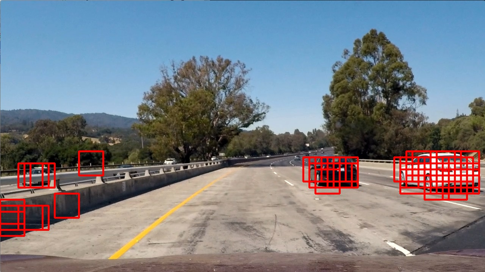
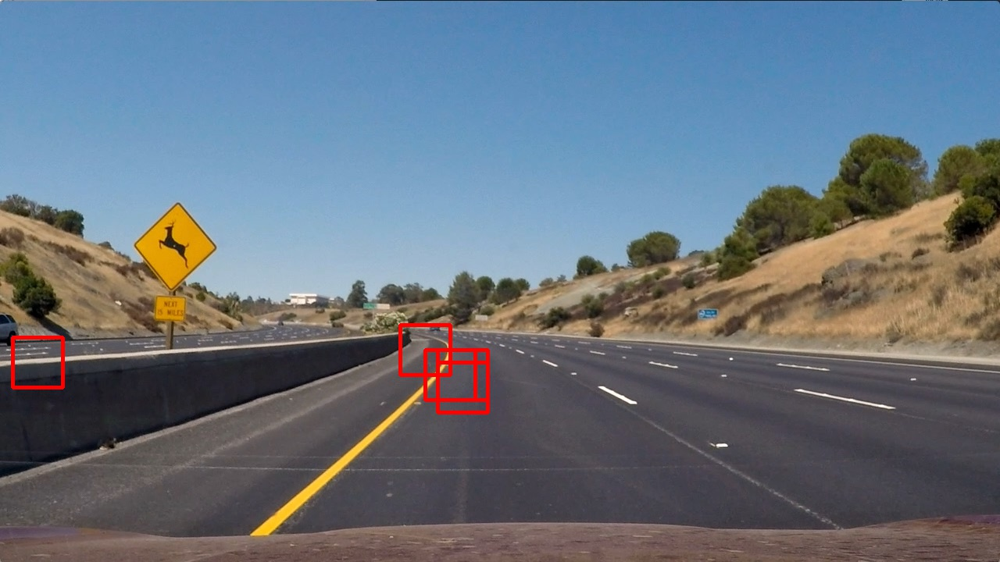
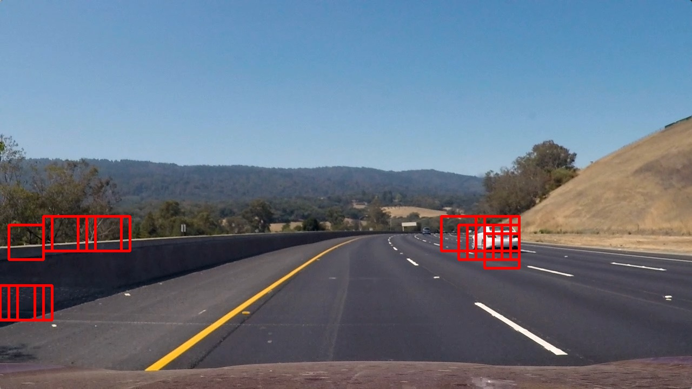
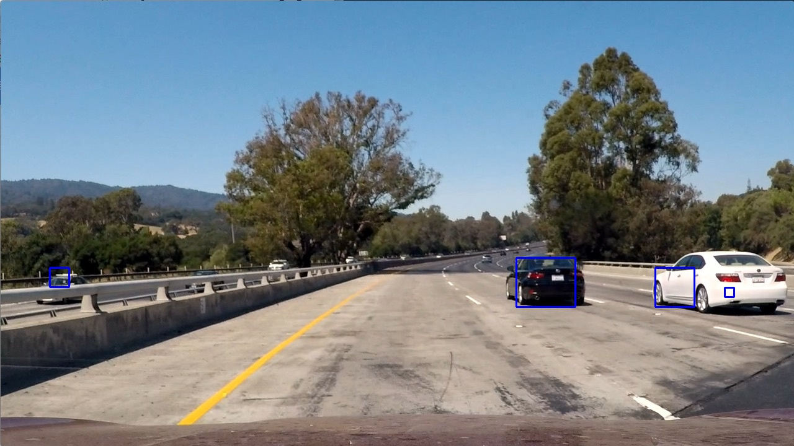
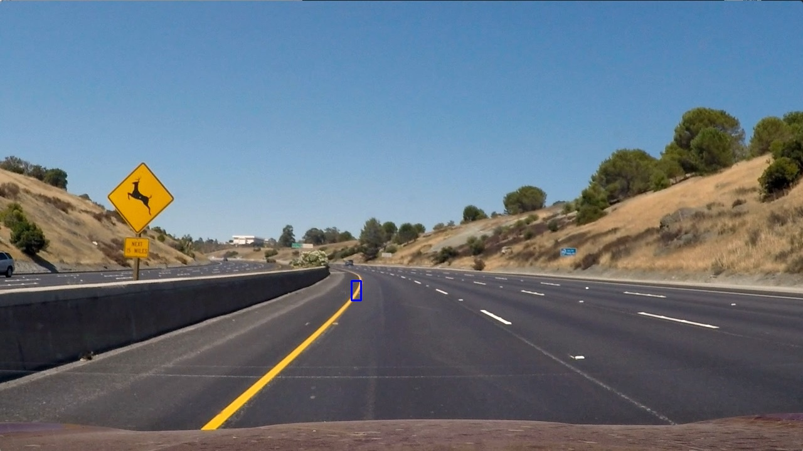
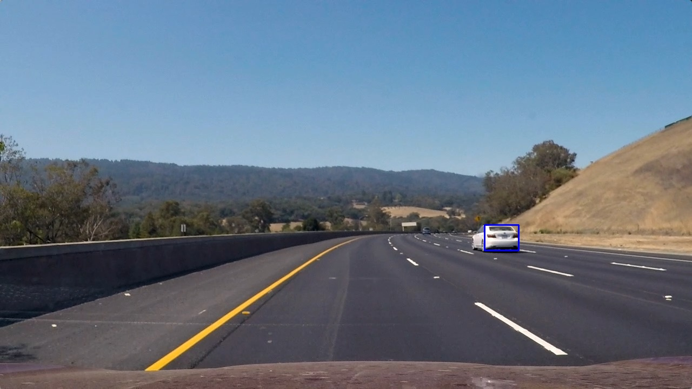
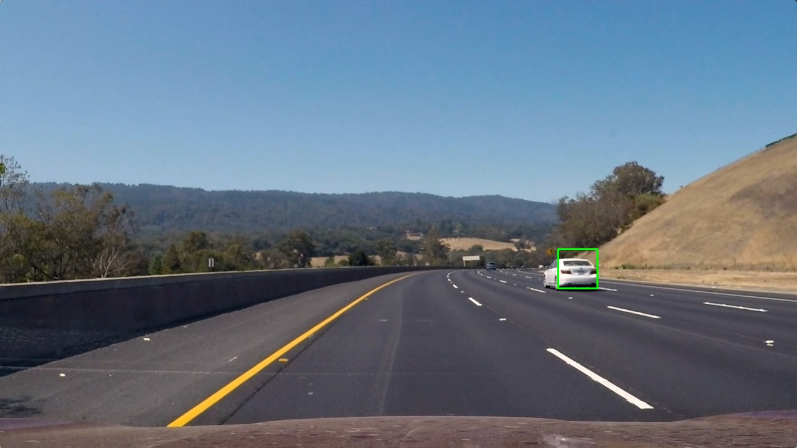

# Vehicle Detection

## Feature extraction

All feature extraction code is in [features](src/features.py) module. At the high-level features of an image
have been extracted using 3 techniques discussed in lectures. All these features are combined into a per
image feature vector. The `extract_features` and `extract_features_for_multiple_images` provide the
feature vectors.

### HOG
Histogram of Oriented Gradients or [HOG](src/features.py) is in the `_get_hog_features` method. This method
extracts hog features for all channels and then flattens into a single vector.

### Color histogram
A feature vector comprising of color histogram can be found in `_get_color_hist_features` in [features](src/features.py).

### Spatial binned features
Spatial binning on an image once it has been reduced down to 32 x 32 is carried out on `_get_bin_spatial_features`
in [features](src/features.py).

## Training a classifier
For this project a `LinearSVC` classifier was trained in [classifier](src/classifier.py) with provided training
data. The classifier is trained in the `train_classifier` method. The trained classifier is stored on the
filesystem to be able to cheaply load it on subsequent run thus saving 30s of classifier training time. This
is done primarily for development productivity.

### Test and train data
Test and train data is derived by loading vehicle and non-vehicle images, extracting features for each image. Using an
80-20 split this data is divided into a training set and a validation set. See the `_get_training_data` method
for implementation of load and features extraction of training data.

### Classifier accuracy
Based on the test set the classifier is reporting an accuracy of `98%`. This classifier might be overfitting
the data at this point.

## Sliding window detection of vehicles
See [SubSampleWindowSearch](src/window.py) for two independent implementations of window based vehicle detection.

### find_cars
This uses the hog sub-sampling window search method. This is the faster of the 2 methods as it computes the hog
features of the entire image once. This method was relatively effective in identifying cars but suffered from
higher false positives and missed detections.

sample 1 | sample 2 | sample 3
---------|----------|----------
  |  | 

As can be seen from the above pictures without heatmap there quite a few false positives. On creating a heatmap to
reduce the false positive there is improvement.

sample 1 | sample 2 | sample 3
---------|----------|----------
  |  | 

 Creating a heatmap definitely reduces the false positives but is not entirely able to eliminate.

### find_cars_in_windows_scaled
This uses the scaled window search where overlapping but varied sized windows are used to detect images. Alongwith the
heatmap based reduction this approach is quite effective in improving detection and removing noise. I suspect this
implementation could be optimized further, however since `find_cars` already explored the single hog feature
extraction approach I decided to leave it out of this implementation for simplicity.

sample 1 | sample 2 | sample 3
---------|----------|----------
  |  | 

### heatmap to reduce false positives and collapse multiple detections
[heatmap](src/heatmap.py) contains Heatmapper which basically adds a heat to each pixel in a box to detect the highest
concentration of a detection to effectively eliminate overlaps and false positives. As is evidenced by previous sections
this is an effective technique.

## Processing video to detect vehicles
[Detect Vehicles](src/detect_vehicles.py) contains the "pipeline" to detect vehicles. It uses the familiar technique
of processing 1 image frame at a time to detect vehicles in the frame and then generating a new output clip.

`_process_frame_2` and `_process_frame` are the actual per frame vehicle detection methods. For generation of
[project video](project_video_output.mp4) I have used `_process_frame_2` which uses the `find_cars_in_windows_scaled`
approach to detect vehicles. Although slower of the 2 approaches it is still more reliable and provides a more correct
output.

## Discussion
At the initial pass I only used `find_cars` to detect vehicles in a frame. Unfortunately the result of this approach
was extremely noisy and poor detection rates. See [project video alternative](project_video_output_3.mp4) as the
original detection representation. Although the real result was significantly worse.

### Overfitting?
Initially, I assumed this was because of overfitting by the classifier which at 98% accuracy seemed
like a reasonable thesis. To test I dropped all but the hog features from the training and detection. Yet, the
result did not improve significantly.

### Wrong windowing choice?
Next thesis was a bad windowing choice at which point I implemented `find_cars_in_windows_scaled` to see if that
improved detection. Definitely, this improved detection on a single image however the resulting video was still
very noisy and full of missed as well as false detections.

### Is the video frame file not RGB?
Given that it was obvious the video frame was not different it was a question of determining the difference
in images. I saved about 10% of the frame to disk in order to understand the difference - at this point it
became obvious that the color fram was different. Using [image_color_transforms.py](src/image_color_transforms.py)
was able to quickly arrive at the image color space as BGR and then it was a simple matter to converting BGR to RGB
for detection. This was the key to a much cleaner detection.

